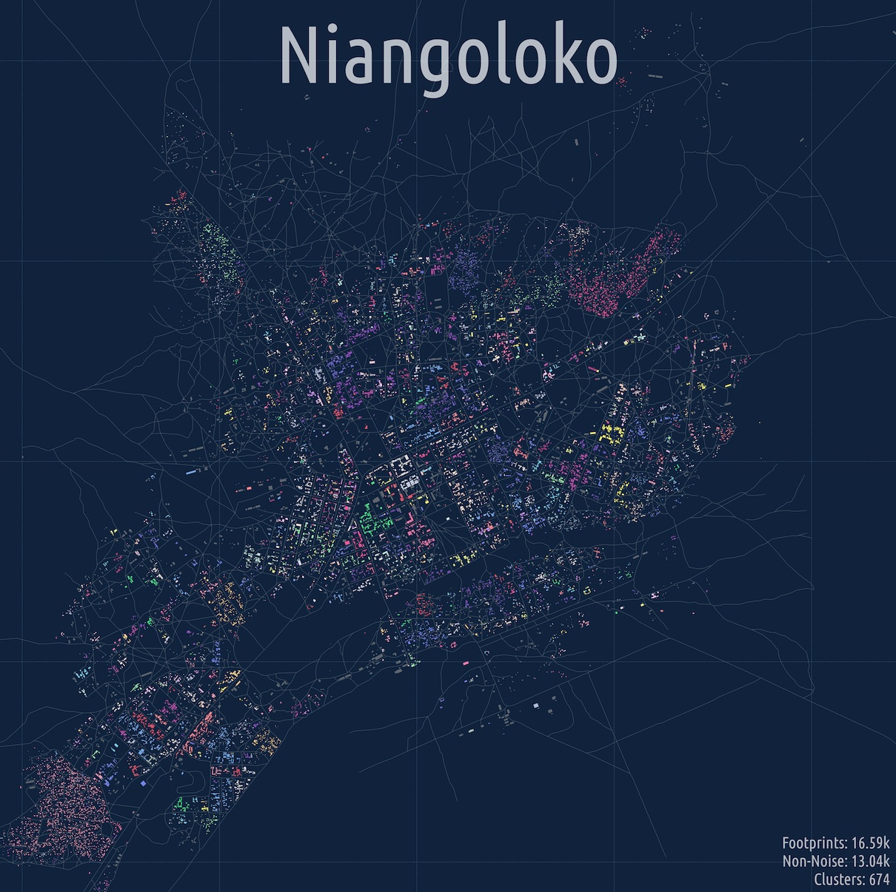

# Burkina Faso

[MGSurvE](https://chipdelmal.github.io/MGSurvE/build/html/index.html) applied to the analysis of realistic landscapes.



# Scripts

1. [lndLandScrape.sh](./lndLandScrape.sh): Goes through a list of geo-coordinates to scrape, cluster and aggregate for use in the pipelines.
   * [lndLandWeb.py](lndLandWeb.py): Downloads geo data from [Open Street Map](https://www.openstreetmap.org) (footprints and roads), and does clustering upon the buildings data (serializing results to disk).
   * [lndMigrationMatrix.py](./lndMigrationMatrix.py): Calculates the distance matrix along with the migration matrix (from the movement kernel), and aggregates the result based on the spatial clustering from the previous script.
2. [srvOptimize.sh](./srvOptimize.sh): Performs the discrete GA optimization of traps' locations.
   * [srvOptimize.py](./srvOptimize.py): Optimizes traps' positions over the aggregate landscape, and serializes results to disk.
3. [srvVideo.sh](./srvVideo.sh): Takes the GA results and exports the results to frames and videos.
   * [srvVideo.py](./srvVideo.py): Exports videos for a given landscape and GA.

# Dependencies

To run the code in this repo, install the following packages:

```bash
mamba create -n MGSurvE_DA python=3.10
mamba activate MGSurvE_DA
mamba install -c conda-forge deap
mamba install libpysal -y
mamba install cartopy -y
mamba install -c conda-forge osmnx
mamba install -c install -c conda-forge ffmpeg
pip install engineering-notation
pip install MGSurvE
```

# Sources

Additional information for these studies.

## Mosquito Movement

* Mosquito Mean Dispersal: https://www.sciencedirect.com/science/article/pii/S0075951113001011?via%3Dihub#fig0005
* Long Dispersal: https://pubmed.ncbi.nlm.nih.gov/8887330/
* MRR in Indonesia: https://parasitesandvectors.biomedcentral.com/articles/10.1186/s13071-019-3640-3
* MRR in Burkina Faso: https://www.nature.com/articles/s41467-022-28419-0#ref-CR41
* Global MRR Assembly: https://www.ncbi.nlm.nih.gov/pmc/articles/PMC4067626/


## Clustering and Aggregation

* Blogpost on DBSCAN: https://geoffboeing.com/2014/08/clustering-to-reduce-spatial-data-set-size/
* DBSCAN Haversine: https://stackoverflow.com/questions/34579213/dbscan-for-clustering-of-geographic-location-data
